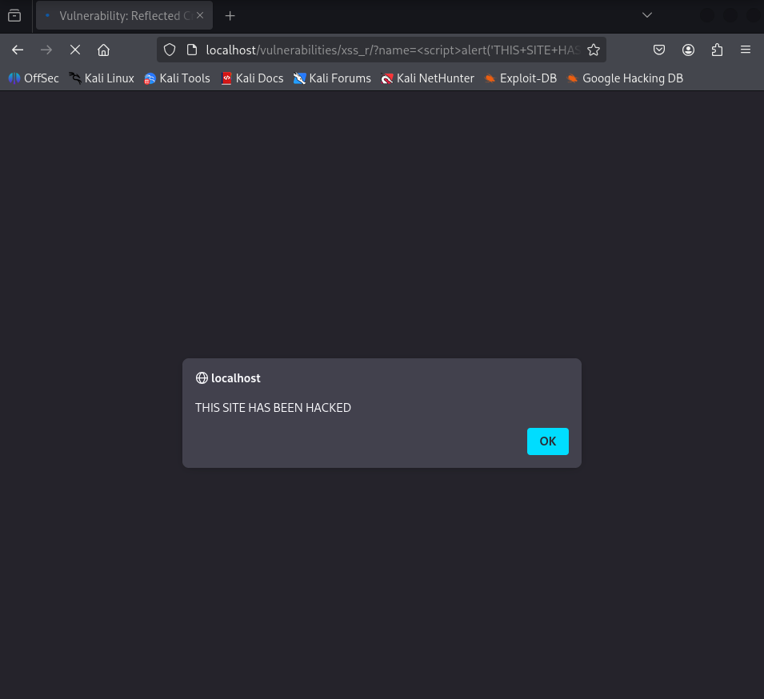
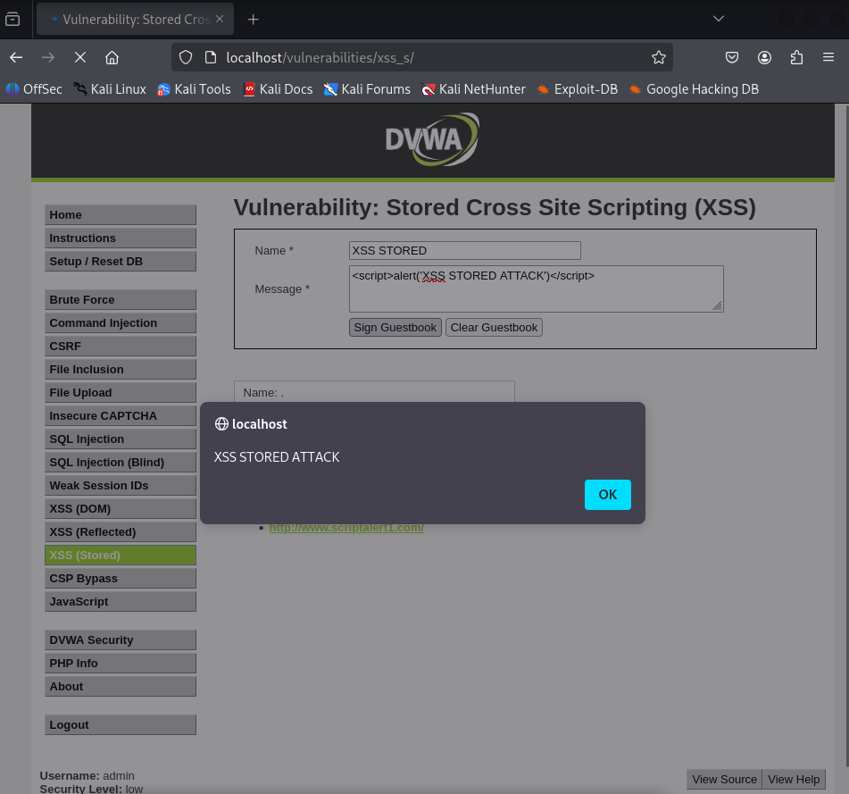
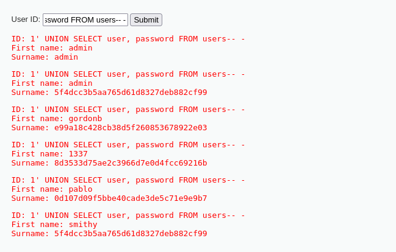
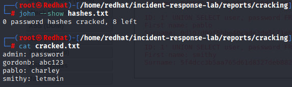
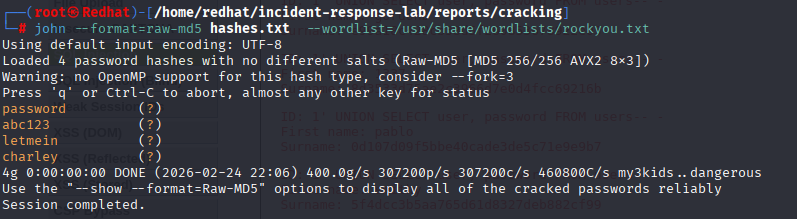

# 🔥 Incident Response Lab - SOC Toolkit


**Complete Incident Response Laboratory** using DVWA (Damn Vulnerable Web Application). Professional documentation of SQL Injection and XSS attacks, SOC analysis with detection methodology, and Python automation scripts.

---

## ⚠️ IMPORTANT DISCLAIMER

> **This project is for EDUCATIONAL PURPOSES ONLY.**  
> The techniques demonstrated here should ONLY be used in controlled environments with explicit authorization.  
> Unauthorized testing against systems you do not own is ILLEGAL and UNETHICAL.  
> The author is not responsible for any misuse of this information.

---

## 📋 Table of Contents
- [Project Overview](#project-overview)
- [Prerequisites](#prerequisites)
- [Lab Architecture](#lab-architecture)
- [Quick Installation](#quick-installation)
- [Project Structure](#project-structure)
- [Attacks Performed](#attacks-performed)
- [SOC Analysis](#soc-analysis)
- [Detection Methodology](#detection-methodology)
- [Included Tools](#included-tools)
- [Results & Evidence](#results--evidence)
- [Security Recommendations](#security-recommendations)
- [Author](#author)

---

## 🎯 Project Overview

This laboratory simulates an **incident response environment** where controlled attacks were performed against a vulnerable web application (DVWA) and the entire process was documented from a Tier 1 SOC analyst perspective.

**Objectives:**
- ✅ Demonstrate SQL Injection and XSS in a controlled environment
- ✅ Document the complete incident lifecycle (detection → containment → eradication → recovery)
- ✅ Automate scans with Python scripts
- ✅ Provide a professional SOC report aligned with ISO 27001 (A.5.26)

---

## 📦 Prerequisites

Before using this lab, ensure you have the following installed:

| Tool | Version | Purpose |
|------|---------|---------|
| **Docker** | 20.10+ | Containerization platform |
| **Docker Compose** | 1.29+ | Multi-container orchestration |
| **Python** | 3.8+ | Automation scripts |
| **Nmap** | 7.80+ | Port scanning |
| **Gobuster** | 3.1+ | Directory enumeration |
| **John the Ripper** | 1.9+ | Password cracking |
| **Git** | 2.25+ | Version control |

### Installation Commands (Kali Linux)

```bash
# Update system
sudo apt update && sudo apt upgrade -y

# Install Docker
sudo apt install -y docker.io
sudo systemctl enable docker --now
sudo usermod -aG docker $USER

# Install Docker Compose
sudo apt install -y docker-compose

# Install Python and pip
sudo apt install -y python3 python3-pip

# Install Nmap
sudo apt install -y nmap

# Install Gobuster
sudo apt install -y gobuster

# Install John the Ripper
sudo apt install -y john

# Install Git
sudo apt install -y git
```

---
## 🏗️ Lab Architecture
```
┌─────────────────────────────────────────────────────────────┐
│ YOUR KALI LINUX │
│ ┌─────────────────────────────────────────────────────┐ │
│ │ DOCKER (Container) │ │
│ │ ┌─────────────────────────────────────────────┐ │ │
│ │ │ DVWA (Damn Vulnerable Web Application) │ │ │
│ │ │ ├── Apache (Port 80) │ │ │
│ │ │ ├── PHP (Vulnerable backend) │ │ │
│ │ │ └── MySQL (Database) │ │ │
│ │ └─────────────────────────────────────────────┘ │ │
│ └─────────────────────────────────────────────────────┘ │
│ │
│ ┌─────────────────────────────────────────────────────┐ │
│ │ PROJECT TOOLS │ │
│ │ - Nmap: Port scanning │ │
│ │ - Gobuster: Directory enumeration │ │
│ │ - John the Ripper: Hash cracking │ │
│ │ - Python: Automation scripts │ │
│ └─────────────────────────────────────────────────────┘ │
└─────────────────────────────────────────────────────────────┘
```

## 🚀 Quick Installation
```bash
# 1. Clone repository
git clone https://github.com/Enocrueda/incident-response-lab.git
cd incident-response-lab

# 2. Start Docker environment
cd docker
docker-compose up -d

# 3. Configure DVWA
# - Open http://localhost
# - Login: admin / password
# - Click "Create/Reset Database"
# - Set security level to "low"

# 4. Run auto scanner
cd ../scripts
chmod +x auto_scanner.py
./auto_scanner.py

# 5. View reports
cd ../reports
ls -la
```

## 📁 Project Structure
```
incident-response-lab/
├── docker/
│   └── docker-compose.yml        # Lab configuration
├── scripts/
│   ├── auto_scanner.py           # Scan automation
│   └── auto_detect.sh            # Log detection script
├── reports/
│   ├── soc_analysis_complete.md  # Complete SOC report
│   ├── sql_injection_complete.md # SQLi documentation
│   ├── xss_complete.md           # XSS documentation
│   └── cracking/
│       ├── hashes.txt            # Extracted hashes
│       └── cracked.txt           # Cracked passwords
├── screenshots/                   # Visual evidence
│   ├── sql_injection_payload.png
│   ├── sql_injection_passwords.png
│   ├── sql_injection_john_the_ripper.png
│   ├── xss_reflected_hacked.png
│   └── xss_storage_hacked.png
├── scans/                         # Scan results
│   ├── nmap/
│   ├── gobuster/
│   └── scan_report.txt
├── logs/                          # Apache logs
│   └── access.log
├── README.md                      # This file
├── LICENSE                        # MIT License
└── .gitignore                     # Ignored files
```
--------------------------------------------------------------------

## ⚔️ Attacks Performed

### 1. SQL Injection
- **Technique:** UNION-based SQL Injection
- **Payload:** `1' UNION SELECT user, password FROM users-- -`
- **Result:** Extraction of 4 password hashes
- **Cracking:** John the Ripper (rockyou.txt wordlist)
- **Credentials Obtained:**
| Username | Password |
|----------|----------|
| admin | password |
| gordonb | abc123 |
| pablo | letmein |
| smith | charley |

### 2. XSS Reflected
- **Payload:** `<script>alert('THIS SITE HAS BEEN HACKED')</script>`
- **Impact:** JavaScript execution in victim's browser
- **Evidence:** 

### 3. XSS Stored
- **Payload:** `<script>alert('XSS STORED - PERSISTENT')</script>`
- **Impact:** Payload stored in database, affects ALL users
- **Evidence:** 

---

## 🛡️ SOC Analysis

The complete report (`reports/soc_analysis_complete.md`) includes:

### Detection Methodology
- Commands used to detect attacks in logs
- Automated detection scripts
- Alert triggers and thresholds

### Indicators of Compromise (IoCs)
- Nmap scan detection
- Gobuster directory enumeration
- SQL Injection payloads
- XSS payloads
- Post-exploitation activity

### Full Incident Timeline
- 10:00 - Reconnaissance (Nmap)
- 10:05 - Directory enumeration (Gobuster)
- 10:30 - SQL Injection exploitation
- 10:45 - Password cracking
- 14:35 - XSS Reflected
- 14:50 - XSS Stored

### Containment, Eradication & Recovery
- Network isolation (IP blocking)
- System isolation (Docker pause)
- Code patching (prepared statements, output encoding)
- Database cleanup
- System restoration

### Lessons Learned & Recommendations
- Critical security fixes
- Process improvements
- ISO 27001 aligned recommendations

📄 **View full report:** [`reports/soc_analysis_complete.md`](reports/soc_analysis_complete.md)

---

## 🔎 Detection Methodology

Real commands used to detect the attacks:

### SQL Injection Detection
```bash
grep -i "union.*select" /var/log/apache2/access.log
grep -E "('|--|#|/\*|;)" /var/log/apache2/access.log
```

### XSS Detection 
``` bash
grep -i "<script>" /var/log/apache2/access.log
grep -i "%3Cscript%3E" /var/log/apache2/access.log
```

### Port Scan Detection 
```bash
grep "192.168.1.100" /var/log/apache2/access.log | awk '{print $4}' | sort | uniq -c
```

### Automated Detection Script
```bash
#!/bin/bash
# auto_detect.sh
LOG_FILE="/var/log/apache2/access.log"
echo "[+] SQL Injection Attempts:"
grep -i "union.*select" $LOG_FILE | wc -l
echo "[+] XSS Attempts:"
grep -i "<script>" $LOG_FILE | wc -l
```

## 🛠️ Included Tools

scripts/auto_scanner.py
Automated scanning script that performs:

```bash
./auto_scanner.py
```
## Features:

✅ Nmap scan (ports and services)

✅ Gobuster scan (hidden directories)

✅ Automatic report generation

✅ Timestamps on every scan

## Example output:
```text
[1/3] 🔍 Scanning ports with Nmap...
    ✅ Nmap scan completed: ../scans/nmap/nmap_scan_20260224_100000.txt

[2/3] 📁 Scanning directories with Gobuster...
    ✅ Gobuster scan completed: ../scans/gobuster/gobuster_scan_20260224_100500.txt

[3/3] 📊 Generating report...
    ✅ Report saved: ../scans/scan_report.txt
```
Generated Results:
scans/nmap/ → Port scan results
scans/gobuster/ → Discovered directories


## 📊 Results & Evidence

### SQL Injection


| Evidence | Description |
|----------|-------------|
|  | UNION SELECT payload |
|  | Extracted data |
|  | Cracking with John |

### XSS Reflected / Stored

| Evidence | Description |
|----------|-------------|
|  | XSS Reflected alert execution |
|  | XSS Stored persistent payload |

## 🔒 Security Recommendations

Based on SOC analysis:

| Priority | Recommendation |
|----------|----------------|
| HIGH | Implement prepared statements for SQL |
| HIGH | Escape output with htmlspecialchars() |
| HIGH | Change default credentials |
| MEDIUM | Deploy WAF (Web Application Firewall) |
| MEDIUM | Automate log analysis |
| LOW | Security training for developers |

## 👨‍💻 Author
Enoc Rueda - SOC Analyst Aspirant
📧 enoctrd@gmail.com
🔗 LinkedIn - (https://www.linkedin.com/in/enoctrd/)
🐙 GitHub - (https://github.com/Enocrueda)


## Related Projects:

- Firewall Log Analyzer

- OSINT SOC Toolkit

## 📄 License
MIT License - See LICENSE file
